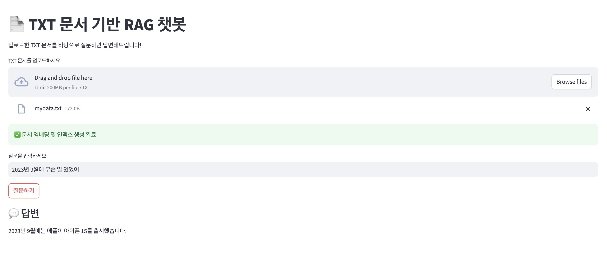
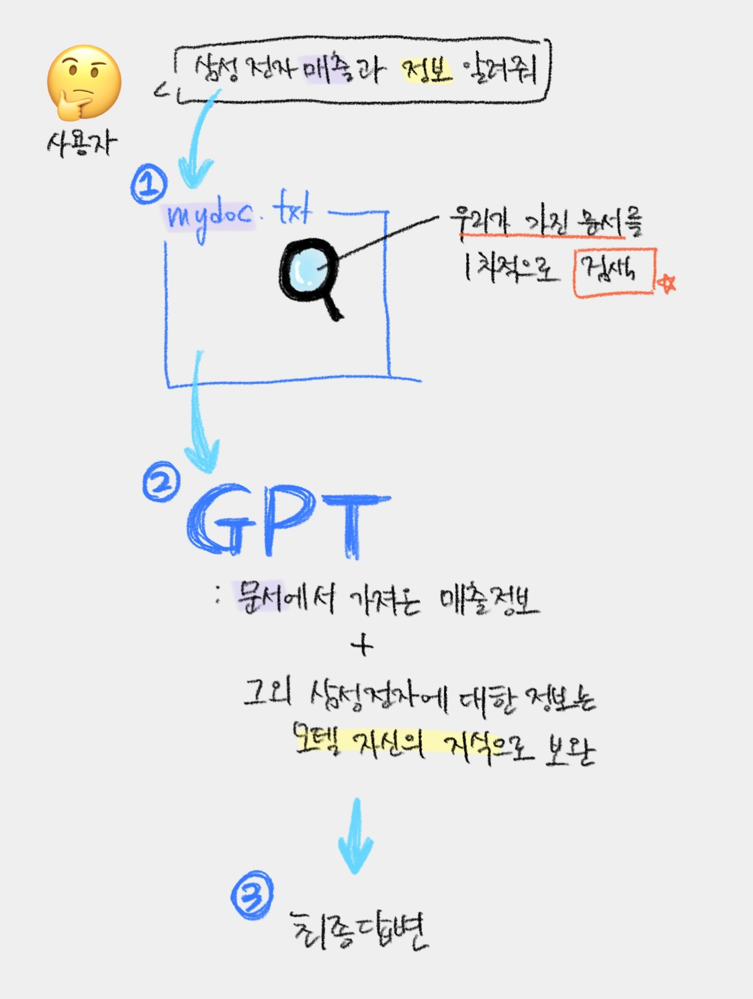

# ask-my-docs (mini RAG)

업로드한 **TXT 문서**를 기반으로 사용자의 질문에 자연어로 답변해주는 **RAG (Retrieval-Augmented Generation) 구조의 챗봇**

1. 문서를 읽고  
2. 의미 단위로 잘라 embedding 후  
3. 가장 유사한 내용 검색 → GPT 모델이 답변 생성합니다.

---

## 프로젝트 구조
```
ask-my-docs/
├── rag_chatbot.py      # Streamlit 메인 파일
├── .env                # OpenAI API Key 저장
├── requirements.txt    # 필요한 라이브러리 명시
└── README.md           # 프로젝트 설명 파일
```


---

## 주요 기술 스택
- Python
- Streamlit
- OpenAI API (`gpt-3.5-turbo`, `text-embedding-ada-002`) **→  credit 필요**
- FAISS (벡터 검색)
- tiktoken (chunking용 tokenizer)
- python-dotenv (API 키 관리)

---

## 실행 방법
1. 패키지 설치
```bash
pip install -r requirements.txt
```

2. 실행
```
streamlit run rag_chatbot.py
```

---
## 실행 화면



- 문서 업로드 후 질문

- 문서 기반으로 GPT가 자연어로 답변 생성

- 예시 질문: 2023년 9월에 무슨 일 있었어?

- 예시 답변: 2023년 9월에는 애플이 아이폰 15를 출시했습니다.

---
## 핵심 기능

- .txt 문서 임베딩 후 벡터 DB 저장

- 사용자 질문 → 의미 기반 검색

- 검색 결과 기반으로 GPT 답변 생성

- Streamlit으로 UI 제공 (웹에서 바로 사용 가능)

